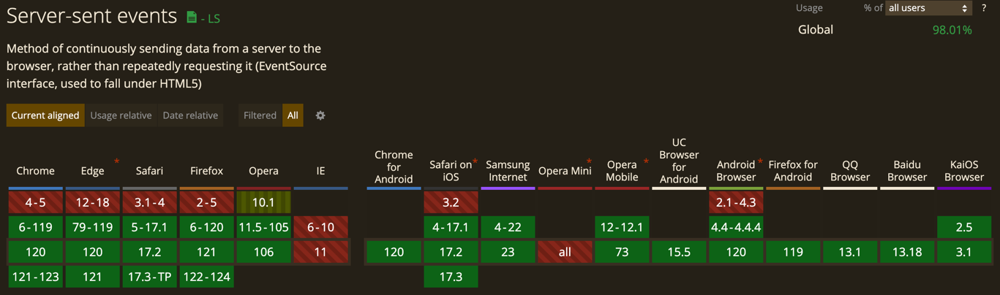

# Server-sent events
* 서버에서 프론트엔드로의 단방향 통신에 사용하기 유리 (웹소켓은 양방향)
* http 프로토콜 사용하며 자동 재접속 지원
* https://web.dev/articles/eventsource-basics
> ### Server-Sent Events vs. WebSockets 
> Why would you choose Server-Sent Events over WebSockets? Good question. 
>
> One reason SSEs have been kept in the shadow is because later APIs like WebSockets provide a richer protocol to perform bi-directional, full-duplex communication. Having a two-way channel is more attractive for things like games, messaging apps, and for cases where you need near real-time updates in both directions. However, in some scenarios data doesn't need to be sent from the client. You simply need updates from some server action. A few examples would be friends' status updates, stock tickers, news feeds, or other automated data push mechanisms (e.g. updating a client-side Web SQL Database or IndexedDB object store). If you'll need to send data to a server, XMLHttpRequest is always a friend. 
>
> SSEs are sent over traditional HTTP. That means they do not require a special protocol or server implementation to get working. WebSockets on the other hand, require full-duplex connections and new Web Socket servers to handle the protocol. In addition, Server-Sent Events have a variety of features that WebSockets lack by design such as automatic reconnection, event IDs, and the ability to send arbitrary events.
* 현재 IE는 지원하지 않음 (https://caniuse.com/?search=Server-sent%20events)
